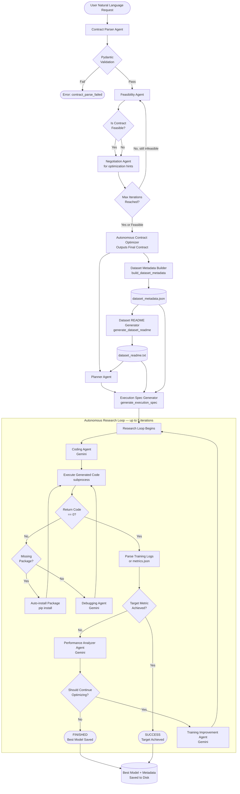

# Autonomous ML Agent

A fully autonomous machine learning pipeline that takes a plain-language user request and delivers a trained, debugged, and iteratively improved model — without any manual intervention. The system orchestrates a multi-agent workflow powered by a locally running quantized LLM (Qwen2.5-7B-Instruct) for planning and contract negotiation, and Google Gemini for code generation, debugging, and performance analysis.

---

## Table of Contents

- [Overview](#overview)
- [System Architecture](#system-architecture)
- [Agent Pipeline Flowchart](#agent-pipeline-flowchart)
- [Agents: Roles and Responsibilities](#agents-roles-and-responsibilities)
- [Dataset Intelligence: Metadata JSON and Dataset README](#dataset-intelligence-metadata-json-and-dataset-readme)
- [Model Details](#model-details)
- [Pydantic Schema Contracts](#pydantic-schema-contracts)
- [Directory Structure](#directory-structure)
- [Installation](#installation)
- [Usage](#usage)
- [Example Run](#example-run)

---

## Overview

Most ML automation tools assume you already know what model to use, what hyperparameters to set, and how to load your data. This system assumes nothing. You give it a natural language request like:

> "Build a house price prediction model with RMSE <= 1 using 8GB VRAM"

and the system:

1. Parses the request into a structured contract
2. Checks whether the contract is feasible given compute and task constraints
3. Negotiates and revises the contract if needed
4. Scans the dataset directory and builds a rich metadata profile
5. Generates a human-and-agent-readable dataset README
6. Produces a training plan with model choice, optimizer, augmentations, and resource strategy
7. Builds a full execution specification
8. Generates complete, runnable training code
9. Executes the code, catches errors, and autonomously debugs them
10. Analyzes training metrics and iteratively improves the training plan until the target metric is achieved or the iteration budget is exhausted

---

## System Architecture

The pipeline is divided into two stages:

**Stage 1 — Contract and Planning (Local LLM: Qwen2.5-7B-Instruct)**
The local model handles structured reasoning tasks: contract extraction, feasibility checking, contract negotiation, and training plan generation. These tasks require strict JSON output and domain reasoning but relatively short context windows, making a quantized 7B model ideal.

**Stage 2 — Code Generation and Optimization Loop (Gemini API)**
Code generation, debugging, performance analysis, and training improvement are delegated to Gemini. These tasks require long-context generation and produce large outputs (full Python scripts), which benefit from a capable API-based model.

---

## Agent Pipeline Flowchart



---

## Agents: Roles and Responsibilities

### 1. Contract Parser Agent

**Function:** `contact_to_json(user_request, model)`

Converts a free-form natural language ML request into a validated JSON contract using the local Qwen model. The model is prompted as an "Autonomous ML Contractor" and instructed to extract exactly five fields. The output is validated against the `MLContract` Pydantic schema before proceeding.

Fields extracted:
- `task_type` — e.g., `image_classification`, `regression`
- `dataset_domain` — e.g., `medical imaging`, `house prices`
- `target_metric` — e.g., `accuracy`, `rmse`
- `target_value` — numeric target, e.g., `0.95`, `1.0`
- `compute_constraint` — e.g., `8GB VRAM`, `16GB RAM`

If Pydantic validation fails, the pipeline halts with `contract_parse_failed`.

---

### 2. Feasibility Agent

**Function:** `feasibility_agent(contract, model)`

Examines the contract and determines whether the target metric is realistically achievable under the stated compute constraint and task complexity. Runs using the local Qwen model.

Output fields (validated by `FeasibilityReport`):
- `feasible` — boolean
- `reason` — plain-text justification
- `suggested_target` — a revised numeric target if infeasible

This agent ensures the system does not waste GPU time on impossible goals.

---

### 3. Negotiation Agent

**Function:** `negotiation_agent(contract, feasibility, model)`

When a contract is infeasible, this agent proposes the minimal set of modifications needed to make it achievable. It is explicitly prompted to explore multiple strategies beyond simply lowering the target value: lightweight architectures, mixed precision, gradient accumulation, transfer learning, reduced image resolution, smaller batch sizes, and compute upgrades.

Output fields (validated by `NegotiationResult`):
- `feasible_after_revision` — whether the revision is now feasible
- `revised_contract` — updated contract JSON
- `optimization_suggestions` — dict of recommended techniques
- `changes_made` — list of specific changes
- `reason` — justification

Optimization suggestions are always returned regardless of feasibility outcome, ensuring the downstream planner always has actionable hints.

---

### 4. Autonomous Contract Optimizer

**Function:** `autonomous_contract_optimizer(user_request, model, max_iterations=3)`

Orchestrates the loop between the Feasibility Agent and the Negotiation Agent. Runs up to `max_iterations` rounds of contract evaluation and revision. Tracks a `contract_distance` score that measures how far the revised contract has drifted from the user's original intent (penalizing large metric reductions and compute upgrades).

Returns the final feasible contract plus the full iteration history and optimization suggestions.

---

### 5. Planner Agent

**Function:** `planner_agent(contract, optimization_suggestions, model)`

Generates a detailed, framework-aware training strategy. A key design decision: the planner reads the task type and chooses between a PyTorch deep learning pipeline and a Scikit-Learn/XGBoost pipeline. For traditional ML tasks, it still populates all Pydantic fields with compatible defaults (`epochs=1`, `batch_size=0`, `optimizer="N/A"`) to avoid downstream schema failures.

Output fields (validated by `TrainingPlan`):
- `recommended_model` — e.g., `EfficientNet-B0`, `RandomForestRegressor`
- `optimizer` — e.g., `AdamW`, `N/A`
- `learning_rate`, `batch_size`, `epochs`
- `loss_function`
- `augmentations` — list of data augmentation strategies
- `training_strategies` — e.g., `mixed_precision`, `transfer_learning`
- `resource_optimizations` — e.g., `reduced_batch_size`, `efficient_backbone`

---

### 6. Dataset Metadata Builder

**Function:** `build_dataset_metadata(input_path, output_json_path)`

Recursively scans the entire dataset directory tree and builds a rich, structured JSON profile. Every file is individually profiled:

- Images — dimensions, mode, format, file size
- CSV files — shape, column roles, semantic guess, sample rows, missing value statistics, full `describe()` output
- Text files — line count, preview lines
- Other files — size, MIME type, extension

A top-level summary aggregates total file counts, extension distributions, and kind counts across the entire tree. The output is saved as `dataset_metadata.json` and becomes the source of truth for all downstream agents.

---

### 7. Dataset README Generator

**Function:** `generate_dataset_readme(metadata_json_path, output_readme_path)`

Transforms `dataset_metadata.json` into a structured, human-and-agent-readable plain-text README. This document is injected directly into the Coding Agent's prompt, giving it everything it needs to write correct data-loading code without seeing the actual dataset.

Sections generated:
- Dataset Overview (root path, total files, total directories)
- File Type Distribution
- Image Data Summary (count, extensions, sample paths)
- CSV File Analysis (semantic guess, target column, column roles, sample rows)
- Important Files (JSON, YAML, XML, TXT, CSV paths)
- Dataset Structure Tree (visual directory tree up to 3 levels)
- Coder Agent Instructions (explicit best-practice guidelines)

---

### 8. Execution Spec Generator

**Function:** `generate_execution_spec(contract, dataset_readme, training_plan, runtime_dataset_info)`

Assembles a single, comprehensive execution specification JSON that encodes every parameter needed to train the model. This spec is passed to the Coding Agent and Research Loop and validated against the `ExecutionSpec` Pydantic schema.

Sections in the spec:
- `dataset_understanding` — embedded dataset README, root path, CSV path, checkpoint directory
- `model_spec` — model name, pretrained flag, framework (timm)
- `training_config` — optimizer, learning rate, batch size, epochs, loss function, scheduler, weight decay, early stopping
- `augmentation_config` — list of augmentation strategies from the training plan
- `optimization_config` — resource optimization strategies
- `evaluation_config` — primary metric, target value, validation split, save-best-model flag
- `hardware_config` — compute constraint, mixed precision flag, GPU flags
- `runtime_requirements` — environment, working directory, checkpoint directory, internet requirement
- `agent_notes` — explicit code-quality instructions injected into every code generation call

---

### 9. Coding Agent

**Function:** `coding_agent(execution_spec, training_plan, dataset_readme, runtime_dataset_info)`

Calls the Gemini API with a structured prompt containing the full execution spec, training plan, runtime info, and dataset README. Generates a complete, runnable Python training script. The prompt enforces:

- Framework selection (PyTorch vs Scikit-Learn) based on `recommended_model`
- Mixed precision if enabled in hardware config
- Best-model saving (via `torch.save` or `joblib`/`pickle`)
- Train-validation split
- Correct dataset path usage from the README
- Kaggle-compatible directory paths

Code is cleaned of markdown fences before execution.

---

### 10. Debugging Agent

**Function:** `debugging_agent(code, stderr, execution_spec, training_plan, dataset_readme)`

When generated code fails at execution, this agent receives the failed code and the full traceback. It is prompted to analyze the root cause (API version mismatch, incorrect data shapes, missing arguments), formulate a generalized fix using stable core API arguments, and output the complete corrected script.

A separate automatic package installer (`install_missing_packages`) handles `ModuleNotFoundError` before invoking the Debugging Agent, avoiding unnecessary API calls for simple import failures. The module-to-package mapping covers common ML aliases (`PIL` → `Pillow`, `cv2` → `opencv-python`, `sklearn` → `scikit-learn`).

---

### 11. Performance Analyzer Agent

**Function:** `performance_analyzer_agent(metrics, execution_spec, training_plan, contract)`

After each successful training run, this agent analyzes the parsed metrics against the contract targets and training plan. It is explicitly told to handle both minimization metrics (RMSE, MSE, Loss) and maximization metrics (Accuracy, F1) correctly.

Output fields:
- `issues_detected` — problems identified in the training run
- `recommendations` — specific improvement suggestions
- `should_continue_optimization` — boolean controlling the research loop
- `estimated_improvement_potential` — confidence estimate for further gains

---

### 12. Training Improvement Agent

**Function:** `training_improvement_agent(training_plan, performance_analysis, metrics)`

Takes the current training plan and the performance analysis and generates an updated plan. Targets metric-specific optimization: for error metrics it minimizes, for success metrics it maximizes. Goals include better optimizers, improved augmentations, better regularization, and hyperparameter tuning.

Output: `updated_training_plan` (full plan JSON) and `changes_made` (list of specific modifications).

---

### 13. Autonomous Research Loop

**Function:** `autonomous_research_loop(..., max_research_iterations=5, max_debug_attempts=10)`

The master orchestrator of Stage 2. Runs up to `max_research_iterations` rounds of: code generation → execution → debugging → metric parsing → contract check → performance analysis → training improvement. Each iteration creates a timestamped experiment directory containing the generated code, execution logs, and metrics JSON.

A dynamic metric evaluator (`is_metric_better`) determines improvement direction automatically based on the metric name — no hardcoded assumptions about accuracy vs. loss.

The best model across all iterations is tracked by `GLOBAL_BEST_METRIC` and copied to a persistent `best_model/best_experiment/` directory with its metadata.

---

## Dataset Intelligence: Metadata JSON and Dataset README

The two-stage dataset intelligence system is one of the most important efficiency contributors in this pipeline.

### dataset_metadata.json

Raw dataset directories are opaque to LLMs — they cannot browse file trees or inspect CSVs. The `build_dataset_metadata` function performs a full recursive scan and encodes everything the agent needs to know into a single structured JSON:

- For every CSV file, it runs `guess_csv_semantics` (which identifies annotation CSVs, text classification CSVs, and tabular CSVs by keyword matching on column names) and `column_roles` (which tags each column as image path, text, label, numeric, categorical, or other). It also extracts the likely target column.
- For every image file, it records dimensions, format, and mode using PIL.
- A top-level `summary` aggregates extension counts and file type distributions for quick agent consumption without needing to traverse the full tree.

This eliminates guesswork in code generation. Without it, the Coding Agent would be forced to hallucinate dataset paths, column names, and data loading logic — a major source of runtime errors.

**Efficiency impact:** Avoids 2–4 extra debug-and-retry cycles per experiment caused by incorrect data loading code. Reduces Gemini API calls spent on error correction.

### dataset_readme.txt

The `generate_dataset_readme` function converts `dataset_metadata.json` into a plain-text document optimized for LLM prompt injection. Plain text is used deliberately over JSON because:

- It is more token-efficient when embedded in prompts
- It is structured in a way that mirrors how a human engineer would document a dataset
- The "Coder Agent Instructions" section at the bottom provides explicit guardrails (use correct paths, use train-validation split, handle missing files, join image paths relative to dataset root) that directly reduce coding errors

The `build_agent_context` function wraps the README with additional framing and enforces a 12,000-character cap to prevent context overflow in Gemini prompts.

**Efficiency impact:** The Coding Agent prompt is grounded with accurate, structured dataset knowledge. This is the single largest contributor to first-attempt code correctness, especially for image datasets with annotation CSVs where path construction is non-trivial.

---

## Model Details

### Local Planning Model: Qwen/Qwen2.5-7B-Instruct

Used for: Contract parsing, feasibility analysis, negotiation, training planning.

Loaded with 4-bit NF4 quantization via BitsAndBytes:

```python
BitsAndBytesConfig(
    load_in_4bit=True,
    bnb_4bit_quant_type="nf4",
    bnb_4bit_compute_dtype=torch.float16,
    bnb_4bit_use_double_quant=True
)
```

- Double quantization reduces the quantization constant memory footprint further
- `torch.float16` compute dtype balances speed and numeric precision
- `device_map="auto"` distributes layers across available GPUs/CPU automatically
- Chat template is applied via `tokenizer.apply_chat_template` for correct instruction-following format
- All planning agents use `do_sample=False` with `repetition_penalty=1.1` for deterministic, non-repetitive JSON output

A commented-out alternative configuration for `Qwen/Qwen2.5-3B-Instruct` is included for environments with less than 8GB VRAM.

### Code Generation Model: Google Gemini (gemini-3.1-flash-lite)

Used for: Code generation, debugging, performance analysis, training improvement.

Accessed via `google.generativeai`. A global rate limiter enforces a minimum 60-second interval between API calls to stay within free-tier quotas. All responses are cleaned of markdown code fences before use.

Gemini is chosen for code generation tasks because:
- Long-context handling for large execution specs and dataset READMEs
- Strong code generation capabilities for both PyTorch and Scikit-Learn pipelines
- Reliable JSON output for structured analysis tasks

---

## Pydantic Schema Contracts

All agent outputs are validated against Pydantic models before being passed downstream. This prevents silent failures where a malformed JSON from the LLM corrupts the pipeline mid-run.

| Schema | Used By | Key Fields |
|---|---|---|
| `MLContract` | Contract Parser | task_type, dataset_domain, target_metric, target_value, compute_constraint |
| `FeasibilityReport` | Feasibility Agent | feasible, reason, suggested_target |
| `NegotiationResult` | Negotiation Agent | feasible_after_revision, revised_contract, optimization_suggestions, changes_made |
| `TrainingPlan` | Planner Agent | recommended_model, optimizer, learning_rate, batch_size, epochs, augmentations |
| `ExecutionSpec` | Execution Spec Generator | framework, task_type, dataset_understanding, model_spec, training_config, hardware_config |

---

## Directory Structure

```
autonomous_ml/
    experiments/
        exp_001/
            generated_pipeline.py
            execution_log.txt
            metrics.json
            training_plan.json
        exp_002/
            ...
    best_model/
        best_experiment/        (copy of best experiment directory)
        best_metadata.json      (best metric, metric name, training plan, execution spec)
    reports/
    checkpoints/

dataset_metadata.json           (generated by build_dataset_metadata)
dataset_readme.txt              (generated by generate_dataset_readme)
```

---

## Installation

```bash
pip install transformers accelerate bitsandbytes sentencepiece
pip install langchain langgraph
pip install pydantic
pip install google-generativeai timm
```

This project is designed to run on Kaggle (GPU T4 x2 or P100). For local runs, a GPU with at least 8GB VRAM is recommended.

---

## Usage

Set your Gemini API key in the notebook:

```python
GEMINI_API_KEY = "your_gemini_api_key_here"
```

Then call the main pipeline function:

```python
user_request = "Build a house price prediction model with rmse <= 1 using 8GB VRAM"
dataset_path = "/kaggle/input/your-dataset"
metadata_json_path = "/kaggle/working/dataset_metadata.json"
readme_path = "/kaggle/working/dataset_readme.txt"

autonomus_pipeline(user_request, dataset_path, metadata_json_path, readme_path)
```

The system handles everything from there: contract parsing, feasibility checking, dataset scanning, plan generation, code writing, execution, debugging, and iterative improvement.

---

## Example Run

**Input:**
```
Build a house price prediction model with rmse <= 1 using 8GB VRAM
```

**Stage 1 — Contract and Planning (Local Qwen):**
1. Contract Parser extracts: `task_type=regression`, `target_metric=rmse`, `target_value=1.0`, `compute_constraint=8GB VRAM`
2. Feasibility Agent marks contract as feasible or adjusts the target
3. Negotiation Agent provides optimization hints (e.g., gradient boosting, feature scaling)
4. Dataset Metadata Builder scans the dataset and identifies CSVs with numeric features and a price target column
5. Dataset README is generated with column roles, sample rows, and coder instructions
6. Planner Agent selects a Scikit-Learn/XGBoost pipeline (not PyTorch) given the tabular regression task
7. Execution Spec is assembled

**Stage 2 — Research Loop (Gemini):**
1. Coding Agent generates a complete Scikit-Learn training script using the dataset README for correct column and path references
2. Script is executed; if it fails, the Debugging Agent fixes it
3. After successful execution, RMSE is extracted from logs
4. Performance Analyzer checks whether RMSE <= 1 and whether to continue
5. Training Improvement Agent adjusts hyperparameters if target is not met
6. Loop repeats until target is achieved or 5 iterations are exhausted
7. Best model is saved to `best_model/best_experiment/`
